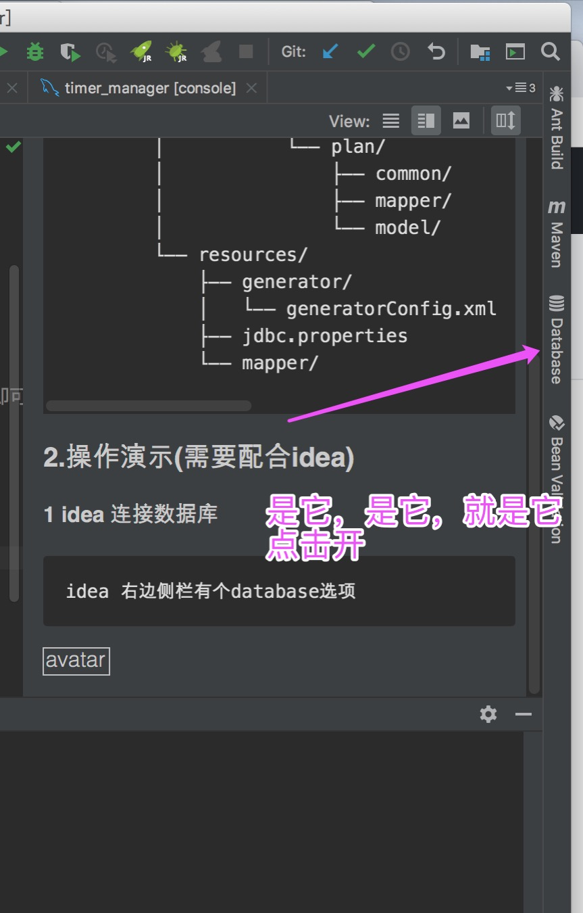
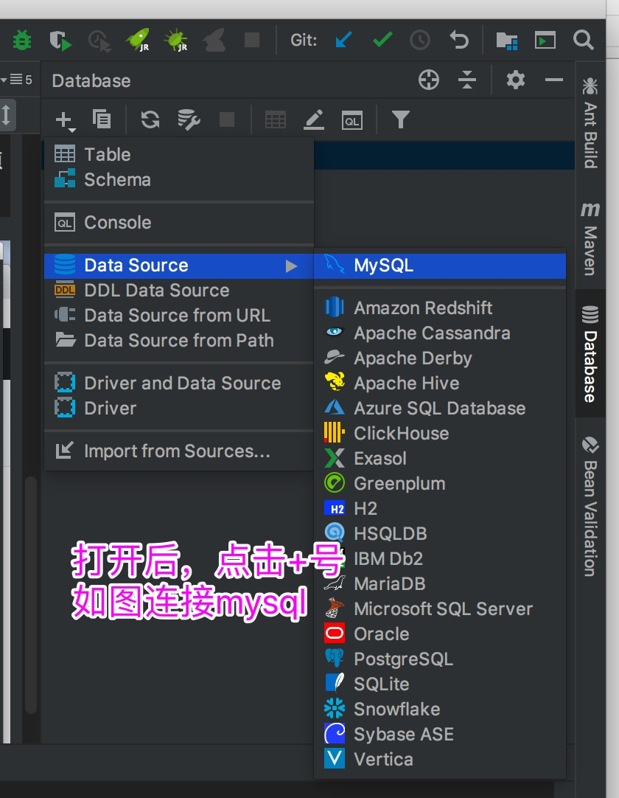
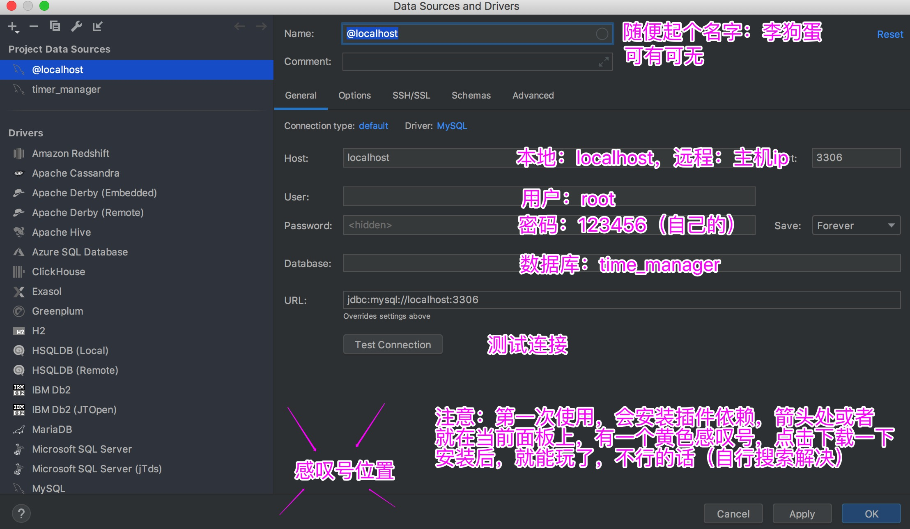
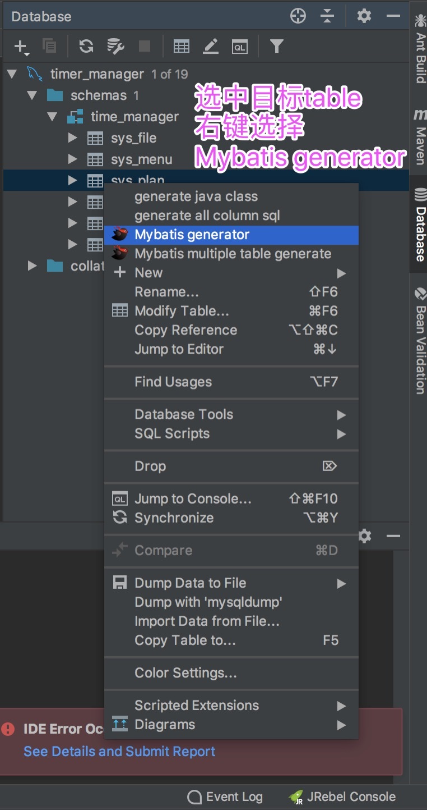
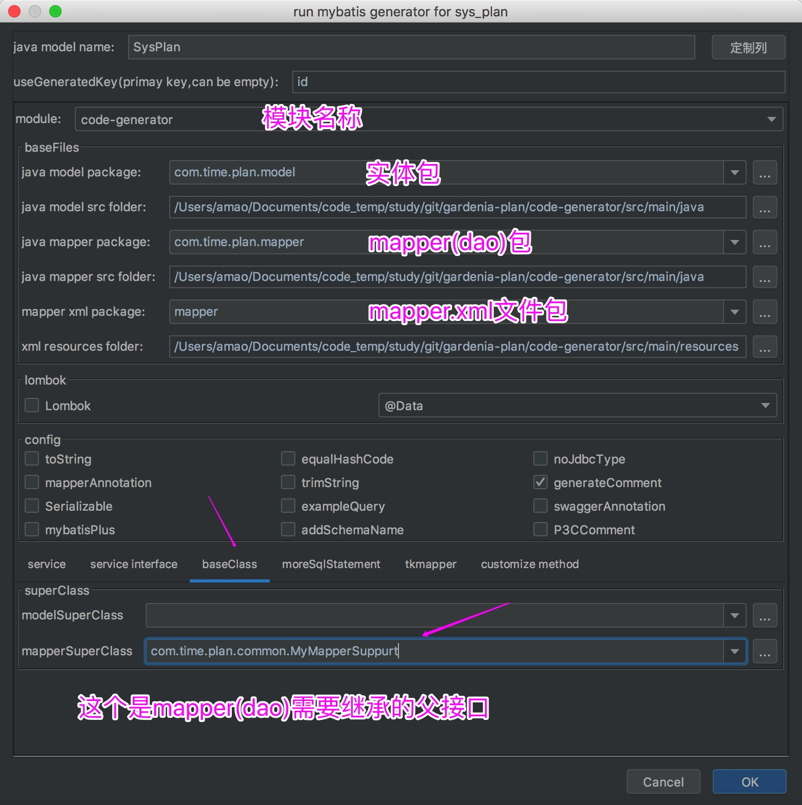
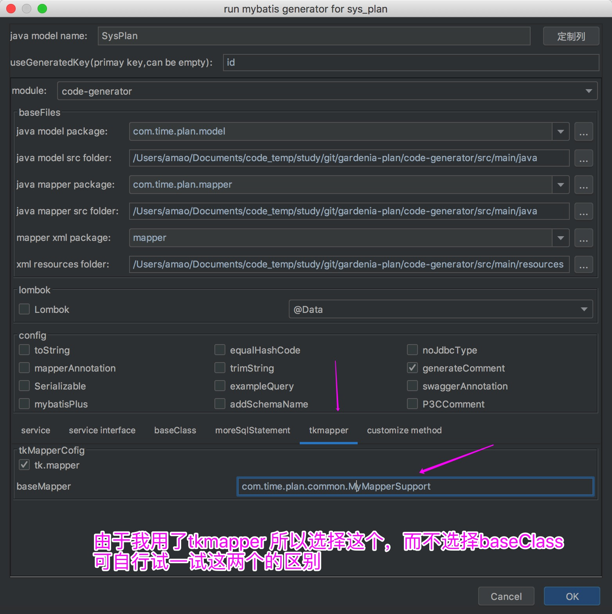
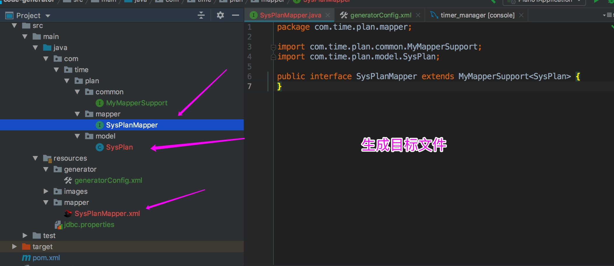

mybatis逆向工程工具

#### 1.工程介绍
    
    ├── README.md
    ├── pom.xml
    └── src/
        └── main/
            ├── java/
            │   └── com/
            │       └── time/
            │           └── plan/
            │               ├── common/             放置了一个mapper的父接口文件
            │               ├── mapper/             逆向工程生成的mapper(dao层)
            │               └── model/              逆向工程生成的实体
            └── resources/
                ├── generator/
                │   └── generatorConfig.xml
                ├── jdbc.properties                 数据源的配置文件(只需要将这个修改为自己的数据源即可)
                └── mapper/                         逆向工程生成的mapper.xml文件
    
  
    
#### 2.操作演示(需要配合idea)

**1 idea 连接数据库**
    
    idea 右边侧栏有个database选项
    

    
    打开连接mysql的面板
    

**2 逆向工程生成文件**

    首先在generatorConfig.xml文件中配置好自己的生成文件路劲
    我的已经连接好了，直接生成操作
    

    
    ⬇️下面图，和⬆️上面图是两种生成方式，选择一个即可
    

  
    
